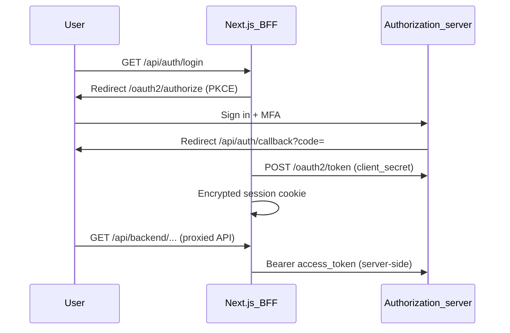

# Auth, MFA, and RBAC Flow

## Login (Authorization Code + PKCE via BFF)

The browser never receives access or refresh tokens. The Next.js server (`staff-portal` OAuth client) performs the code exchange and stores tokens in an encrypted iron-session cookie.

## Session and idle timeout

- Session state: `GET /api/auth/session` (user + expiry only).
- API calls: `/api/backend/*` proxy adds `Authorization` server-side.
- Idle: `SESSION_IDLE_MS` (default 10 minutes) enforced in middleware and on each proxy request.
- Idle warning: client UI; **Stay signed in** triggers full re-login (`prompt=login`), not refresh.
- Staff portal has **no** refresh token grant; access renewal requires re-authentication.

## Force password change

When `/api/auth/session` reports `forcePasswordChange`, `RouteGuard` redirects to `/account/force-password-change`. After password change, call `refresh()` to reload session from the server.

## Step-up authentication

High-risk operations (identity user/role mutations, GL approve/reject) require JWT `acr` gold (MFA at login). On HTTP 403 step-up errors, the UI redirects via `GET /api/auth/step-up`.

## Authorization (RBAC)

`RouteGuard`, `NavGuard`, and `Can` use permissions from the BFF session payload (derived from the access token at login).
