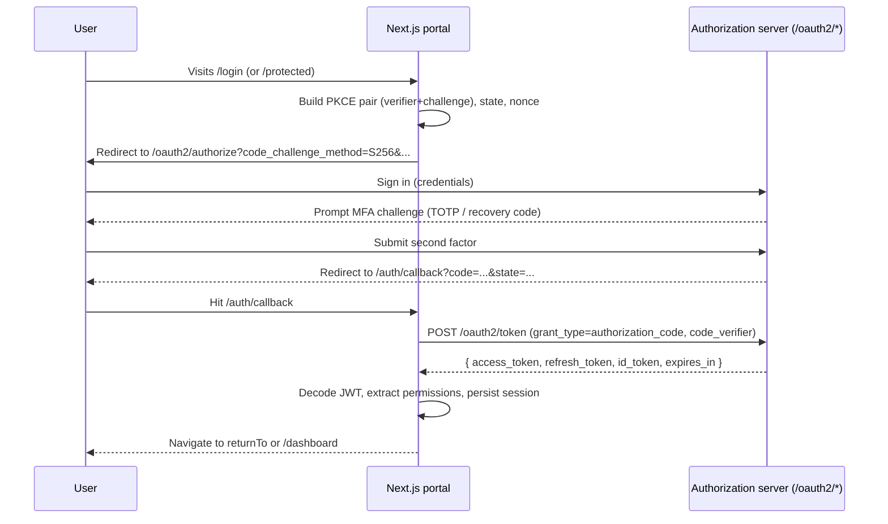

# Auth, MFA, and RBAC Flow

## Login (Authorization Code + PKCE)

## Force password change handling

When the access token contains `force_password_change=true`:

1. The auth store sets status to `force-password-change`.
2. `RouteGuard` redirects to `/account/force-password-change`.
3. After a successful password change, the portal calls `refresh()` which fetches a new token (where the claim should now be `false`).
4. The portal then routes to `/dashboard` (or the original `returnTo`).

## Token refresh and idle timeout

- `AuthProvider` schedules a refresh approximately one minute before `expiresAt`.
- All API requests are routed through the centralized client (`lib/api/client.ts`) which awaits any in-flight refresh and retries with a fresh token.
- The `IdleTimeoutWatcher` listens for activity events on the window. If the user is idle for `NEXT_PUBLIC_IDLE_TIMEOUT_MS` minus `NEXT_PUBLIC_IDLE_WARNING_MS`, a warning dialog opens. Continued inactivity triggers a forced logout.

## Authorization (RBAC)

Three layers all consult the same JWT `permissions` set:

- `RouteGuard` - protects pages and triggers `AccessDenied` when permissions are missing.
- `NavGuard` - hides sidebar sections / items the user cannot access.
- `Can` - guards individual buttons or bulk actions.

Permission strings are normalized in `lib/auth/jwt.ts` to support both array-style and space-separated `permissions` claims, and to merge any overlapping `authorities` claim.
